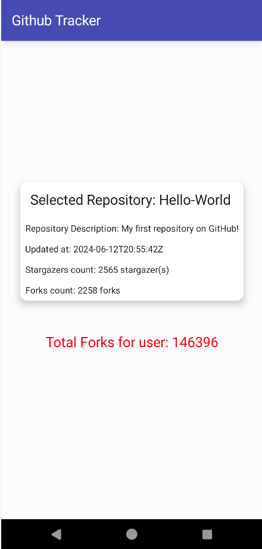
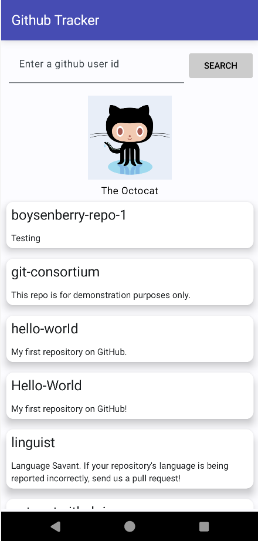

## About Github Tracker

Github Tracker is an Android app which communicates with the public Github API in order to display
information about a specific user.

The app accepts a github user's id as input and displays the specified user's avatar and name.

- For each public repository owned by the user, the name and description are shown in a scrollable list.
- When a repository is selected, user is directed to a detail screen which displays the details regarding that specific repo.

### Environment

Github Tracker is an Android app which communicates with the public Github API in order to display
information about a specific user.
* Kotlin
* Jetpack Compose
* Material Design 3

### Architectural Pattern

explain your implementation, how the layers are organized and
interact, and what the benefits are

Model-View-ViewModel (MVVM) and Repository architecture pattern were used along with Dagger Hilt for dependency injection to facilitates easier testing and maintenance.
The model layer includes the User and Repo data models representing the data received from the GitHub API.
The repository layer handles the actual API calls using the GitHubApiService interface.
The ViewModel layer gets data repository and exposes it to the UI by handling API calls asynchronously.
Finally, the View layer includes the composables rendering the UI based on the state provided by the ViewModel.
The benefits are: separation of concerns, testability, Reusability, and Asynchronicity.

were used in this Android development to separate logic from the UI.

## Testing
-Automated testing used:
* unit tests: tests were run on both ViewModel and Repository classes related to fetching data from GitHub API in an Android
A 'FakeGitHubApiService' was created to mimic the behavior of the real GitHub API when testing if the repository fetches user data and repositories correctly.
ViewModel was tested for correctly handling a successful user data fetch and an error during user data fetch.
* UI test: this test was run using Hilt for dependency injection setup to verify that user data is displayed correctly on the screen

### Screenshots

 
 

